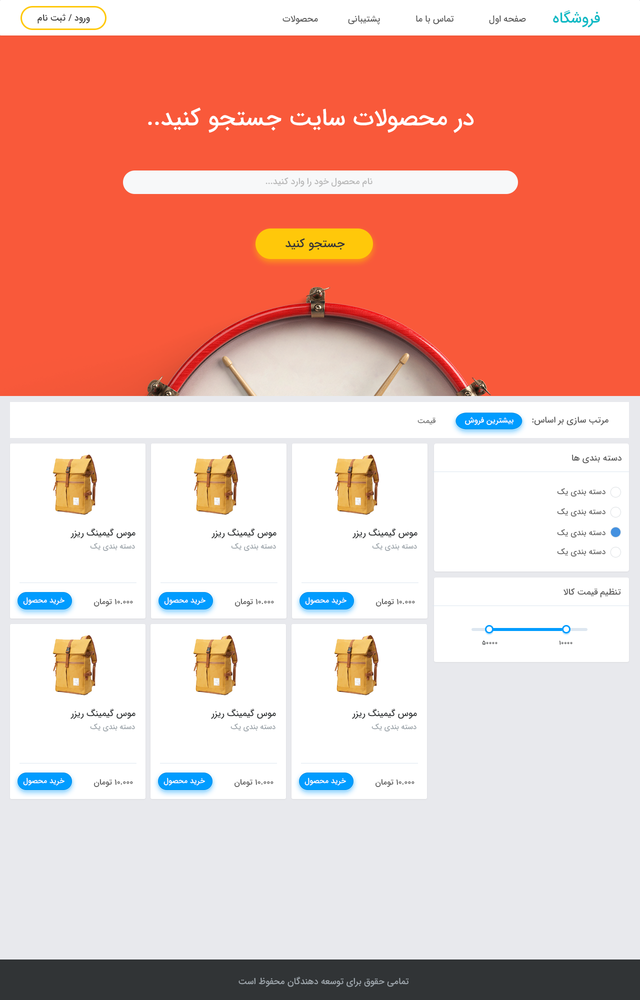
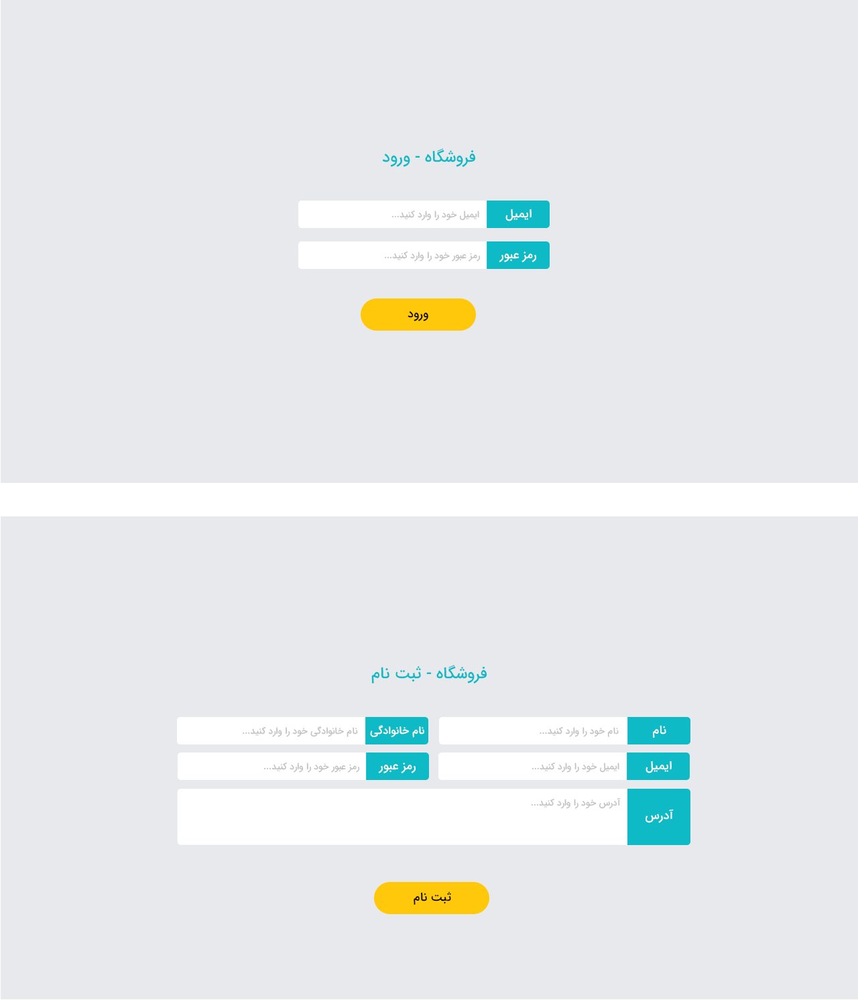
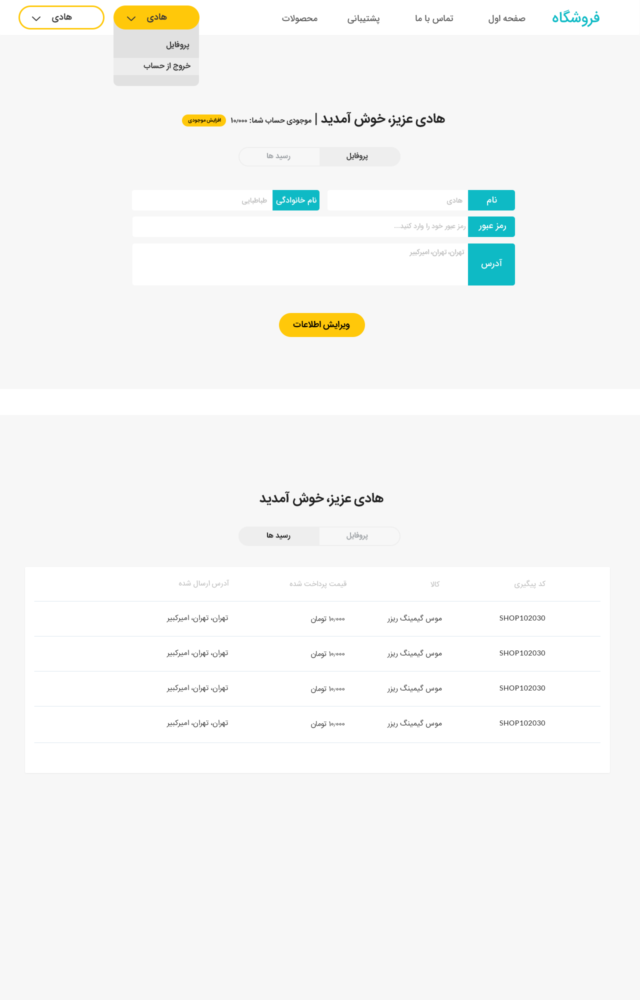
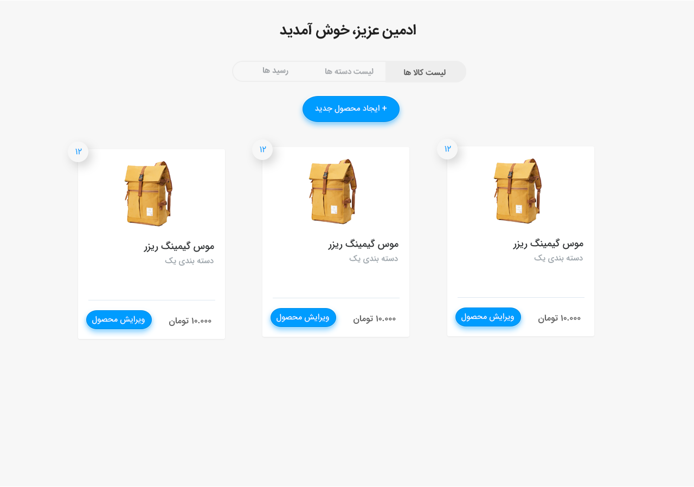

# 🛒 Online Shop

A full-featured e-commerce web application built with **Flask**, featuring a customer storefront and a complete admin dashboard. The interface is in **Persian (Farsi)** with a right-to-left (RTL) layout.

> Developed as a university web-programming project.

---

## ✨ Features

### 🏬 Storefront (Customers)
- **Product catalog** with a responsive product grid.
- **Search** products by name.
- **Sorting** by price (ascending / descending), best-selling, and newest.
- **Filtering** by category and by an adjustable price range.
- **Shopping cart** — add items (stock is reserved on add), adjust quantities, and remove items (stock is restored).
- **Checkout** with wallet balance — purchases are validated against the user's credit, generate order receipts, and update sales counts.
- **Wallet / credit** top-up.

### 👤 Accounts & Authentication
- **Sign up / sign in** with both client-side and server-side validation (email format, password rules).
- **Hashed passwords** (Werkzeug) — credentials are never stored in plain text.
- **Session management** via Flask-Login.
- **Profile management** — update name, password, and address.
- **Order tracking** — customers can view the status of their own receipts.

### 🛠️ Admin Dashboard
- **Product management** — create, edit, and delete products.
- **Category management** — create, rename, and delete categories (products of a deleted category are reassigned to the default category).
- **Order management** — browse all receipts, search by tracking code, and update order status (_in progress_ / _completed_ / _cancelled_).
- **Role-based access** — admin-only routes are protected and redirect non-admin users.

---

## 🖼️ Demo

| Storefront | Sign in / Sign up |
| :---: | :---: |
|  |  |

| User profile & order tracking | Admin — products |
| :---: | :---: |
|  |  |

| Admin — categories & orders |
| :---: |
|  |

---

## 🧰 Tech Stack

| Layer | Technologies |
| --- | --- |
| **Backend** | Python, Flask (Blueprints) |
| **Database** | SQLite via Flask-SQLAlchemy (ORM) |
| **Auth** | Flask-Login, Werkzeug password hashing |
| **Frontend** | Jinja2 templates, HTML5, CSS3, vanilla JavaScript (Fetch API) |
| **Typography** | Yekan Persian web font |

---

## 📁 Project Structure

```
Online-Shop/
├── main.py                 # Application entry point
└── website/
    ├── __init__.py         # App factory, DB setup, and data seeding
    ├── models.py           # SQLAlchemy models (User, Admin, Product, Category, Basket, Receipt)
    ├── views.py            # Storefront, user, and admin page routes
    ├── auth.py             # Sign up / sign in / profile / wallet routes
    ├── admin.py            # Admin actions (products, categories, receipts)
    ├── user.py             # Cart and purchase routes
    ├── templates/          # Jinja2 HTML templates
    └── static/
        ├── css/            # Page stylesheets + Yekan font
        ├── js/             # Per-page client-side logic
        └── Pictures/       # Images and screenshots
```

---

## 🚀 Getting Started

### Prerequisites
- Python 3.7+

### Installation

```bash
# 1. Clone the repository
git clone https://github.com/AlirezaAbedinii/Online-Shop.git
cd Online-Shop

# 2. (Recommended) Create and activate a virtual environment
python -m venv venv
# Windows:
venv\Scripts\activate
# macOS / Linux:
source venv/bin/activate

# 3. Install dependencies
pip install -r requirements.txt

# 4. Run the app
python main.py
```

The development server starts at **http://127.0.0.1:5000**.
Open the storefront at **http://127.0.0.1:5000/main** (or sign in at **/signin**).

On first run the database is created automatically and seeded with a default category, 40 sample products, and the demo accounts below.

### 🔑 Demo Accounts

| Role | Email | Password |
| --- | --- | --- |
| **Admin** | `admin@admin.com` | `adminpass1` |
| **Customer** | `alireza@arezz.com` | `arezzpass1` |

> ⚠️ These are seeded demo credentials for local development only — change them before any real deployment.

---

## 📝 Notes

- The SQLite database (`website/database.db`) is generated locally on first run and is intentionally **not** tracked in version control.
- The default `SECRET_KEY` in `website/__init__.py` is for development only; set a strong, secret value before deploying.

---

## 📄 License

This project is licensed under the [MIT License](LICENSE).
